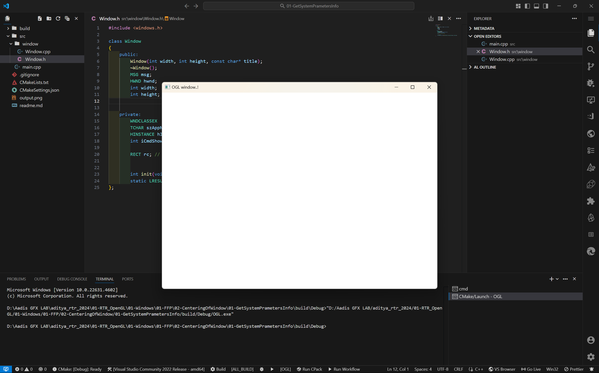

# Centering Of Window using GetSystemMetrics()

- This is just a empty window using Win32 API, which will open in center of the screen.
- If you happen to run it, you will need to end the process from task manager

## Output

