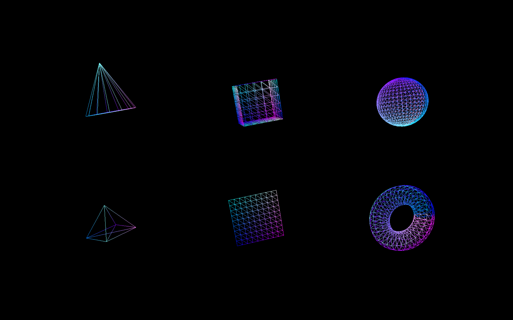

# Procedural 2D/3D Geometries

## Output

## Technical Details

- Window

  - Created window using win32 API.
  - Open in Center of the screen.
  - Add Icon on window and taskbar.
  - Fullscreen toggle on pressing 'f'/'F'.
  - A Logging mechanism with File I/O.
  - On Window active setfocus Kill focus.

- OpenGL

  - Added Procedural Geometries

    - Cone
    - Cube
    - Sphere
    - Plane
    - Torus

  - Structural changes:
    - Geometry : vertices data to alias Geometries
    - Material : Shaders to alias Materials
    - Mesh : holds all object data.
    - Scene : Added Scene to hande all Objects/Mesh.
    - Camera : Added Camera Struct.
    - Logger : updated for INFO, DEBUG, WARN, ERROR.

- Build Tool - Cmake:

  - Added precomp header for fast compilation.

- Third party Libraries used:
  - GLM - for mathematics

## Steps to build

    1. Download the code
    2. Open CMD in this folder.
    3. mkdir build && cd build
    4. cmake ..
    5. cmake --build . --config Debug
    6. Debug\OGL.exe
        OR
    7. double click on the OGL.exe in build/Debug/OGL.exe
