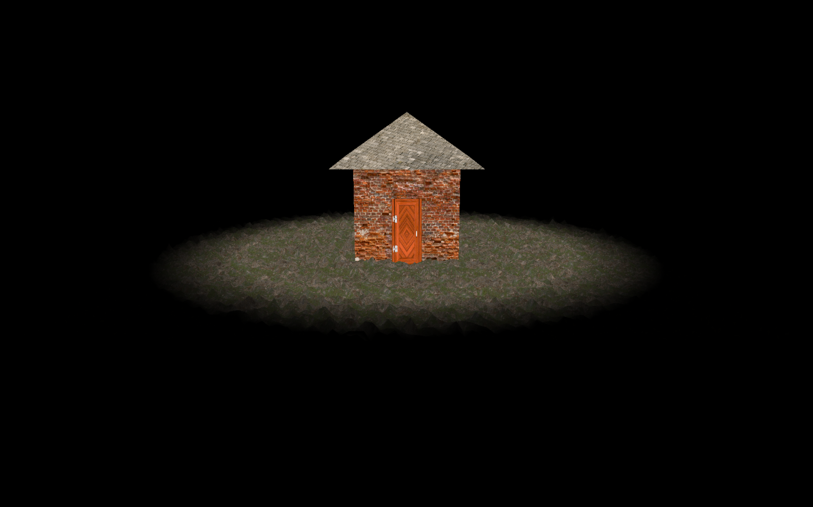

# 3DRotate cube

## Output

## Technical Details

- Win32 API for Window Creation with below feature
  - Open in Center of the screen.
  - Add Icon on window and taskbar.
  - Fullscreen toggle on pressing 'f'/'F'.
  - A Logging mechanism with File I/O.
  - On Window active setfocus Kill focus.
- OpenGL
  - Cube created in OpenGL.
  - Rotate Cube, used chrono for getting elapased time.
- Libraries used:
  - GLM

## Steps to build

    1. Download the code
    2. Open CMD in this folder.
    3. mkdir build && cd build
    4. cmake ..
    5. cmake --build . --config Debug
    6. Debug\OGL.exe
        OR
    7. double click on the OGL.exe in build/Debug/OGL.exe
