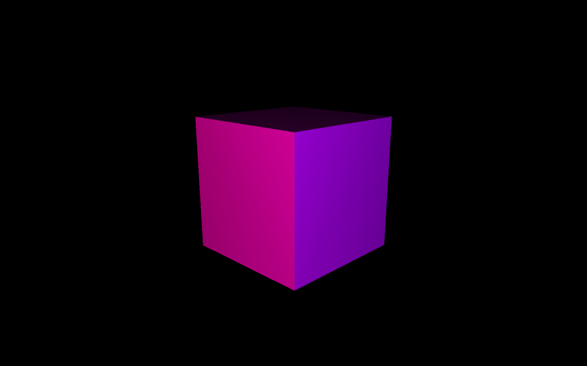

# Two lights on Cube.

## Build Steps

- <a href="https://download-directory.github.io/?url=https://github.com/maliaditya/RTR-OpenGL/tree/main/01-Windows/02-PP/12-TwoLightsOnCube" style="display:inline-block;padding:10px 20px;font-size:16px;color:white;background-color:#007bff;text-decoration:none;border-radius:5px;">Download TwolightsOnOneCube</a>

1. Open CMD in the project folder.
1. Run the following commands:
   - `mkdir build && cd build`
   - `cmake ..`
   - `cmake --build . --config Debug`
1. To run the program:
   - `Debug\OGL.exe` (from the build folder)
     OR
   - Double-click `OGL.exe` in `build/Debug/`.

## Output

## Technical Details

### Window

- **Created using the Win32 API**.
- **Centered on the screen**.
- **Icon**: Added to both window and taskbar.
- **Fullscreen toggle**: Press 'f'/'F' to toggle fullscreen mode.
- **Focus handling**: Kills focus when the window is inactive.
- **Logging**: A file I/O-based logging system is implemented, supporting INFO, DEBUG, WARN, and ERROR levels.

### OpenGL

- **Procedural Shapes**:

  - Cone
  - Cube
  - Sphere
  - Plane
  - Torus

- **Structural Changes**:

  - **Geometry**: Holds vertex data.
  - **Material**: Stores shaders.
  - **Mesh**: Stores all object data.
  - **Scene**: Manages objects and meshes.
  - **Camera**: Added Camera struct for easier scene navigation.
  - **Logger**: Now supports different log levels (INFO, DEBUG, WARN, ERROR).

- **Multitexturing**:

  - Alpha blending
  - Displacement
  - Color maps
  - Normals

- **Camera**:

  - **Orbit-style camera**: Rotate the scene using mouse drag (L button pressed); stops rotating when the L button is released.
  - **Targeting**: Once set, the camera targets an object and looks at it.

- **Lighting**:
  - `Diffuse` light added to the scene.
  - Added PerVertex Phong `Ambient` + `Diffuse` + `SpecularLight`.
  - Added PerFragment Phong `Ambient` + `Diffuse` + `SpecularLight`.
  - Added Two lights on Cube.

### Build Tool (CMake)

- Added precompiled header for faster compilation.

### Third-Party Libraries Used

- **GLM**: For math operations.
- **stb_image**: For texture loading.

## Dependencies

To build and run this project, you need the following dependencies:

- **Windows OS**
- **MSVC 17 (Visual Studio 2019/2022)**: Microsoft Visual Studio 2019 or 2022 with the MSVC 17 compiler.
- **CMake**: For building the project.
- **Ninja**: A build system used with CMake to speed up the build process.
- **GLM**: (automatically fetched from GitHub).
- **stb_image**: (automatically fetched from GitHub).
- **GLEW**: OpenGL Extension Wrangler Library (automatically fetched from GitHub).
